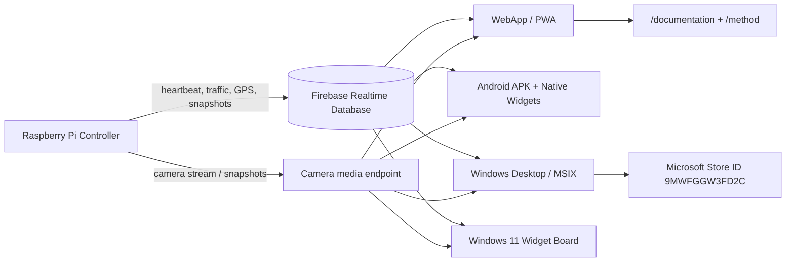
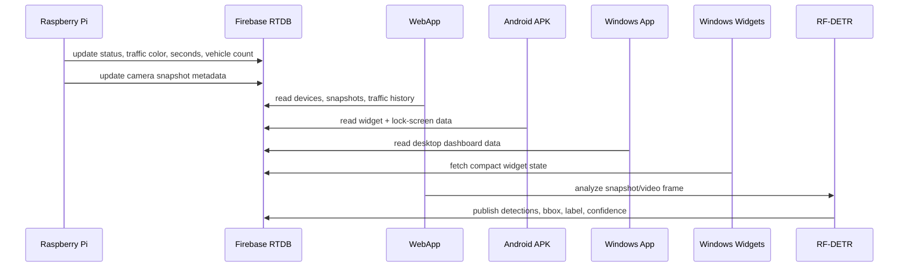
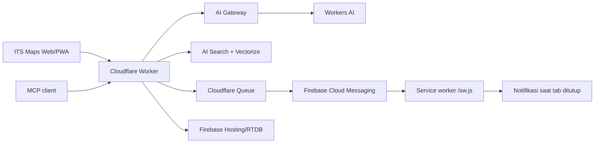

# ITS Maps

ITS Maps adalah aplikasi realtime untuk peta, kamera, grafik lalu lintas, object detection berbasis AI RF-DETR, Android widgets, Windows 11 widgets, dan dashboard Raspberry Pi controller.

Developer: **Hanifa Septhi Larasati**
Publisher: **Hanifa Teams**
Repository: <https://github.com/hanifasepthi/its>
Website: <https://itstelkom.web.app/>

## Download dan Link Resmi

| Platform | Link | Status |
| --- | --- | --- |
| WebApp / PWA | <https://itstelkom.web.app/> | Live |
| Privacy Policy | <https://itstelkom.web.app/privacy> | Live, untuk Microsoft Store certification |
| Dokumentasi utama | <https://itstelkom.web.app/documentation> | Live, berisi atlas kode baris per baris |
| Method portal | <https://itstelkom.web.app/method> | Live |
| Method Android | <https://itstelkom.web.app/method/android> | Live |
| Method Windows | <https://itstelkom.web.app/method/windows> | Live |
| Method WebApp | <https://itstelkom.web.app/method/webapp> | Live |
| Preview PDF | <https://itstelkom.web.app/pdf-preview/documentation> | Viewer dokumentasi gaya jurnal dengan sidebar, toolbar, print/save PDF, dan QR |
| Licence | <https://itstelkom.web.app/licence> | Live, sama dengan `LICENSE` GitHub |
| Android APK | <https://itstelkom.web.app/artifacts/apps/ITS-Maps-Android-1.0.36.apk.b64> | Public APK package encoded |
| Android APK langsung | <https://github.com/hanifasepthi/its/releases/download/its-maps-android-1.0.36/ITS-Maps-Android-1.0.36.apk> | Public APK package via GitHub Release |
| Microsoft Store | Store ID `9MWFGGW3FD2C` | Deep link web tersedia setelah produk live |
| Microsoft Store app protocol | `ms-windows-store://pdp/?productid=9MWFGGW3FD2C` | Membuka Microsoft Store di Windows |

## Ringkasan Fitur

| Fitur | WebApp | Android APK | Windows / MSIX | Windows Widgets |
| --- | --- | --- | --- | --- |
| Peta realtime | Leaflet, MapLibre, OpenFreeMap, OSM, CARTO fallback | Capacitor WebView + native location | Electron renderer | Peta tile/media widget |
| Kamera | WebRTC/MJPEG/HLS fallback | Kamera widget dan lock-screen dashboard | Fullscreen, mini player, PiP, ambient light | Snapshot media |
| AI object detection | RF-DETR ONNX di browser | Snapshot/lock-screen AI view | Video AI segment dan detection overlay | AI snapshot/bbox media |
| Grafik lalu lintas | Realtime history | Widget grafik Android | Desktop chart | ITS Live widget |
| Data kendaraan | Mobil, motor, bus, truk, sepeda, total | Widget dan lock screen | Desktop dashboard | 2 x 3 vehicle tiles |
| Alert/status | RTDB + notification | Data Full & Alert widget | Desktop panels | Data Full & Alert widget |
| Privacy/Store pages | `/privacy`, `/documentation`, `/method` | Data safety support | Store declaration support | Adaptive Card documentation |

## Arsitektur End-to-End



## Realtime Data Flow



## Formula dan Logika Utama

### 1. Status realtime

Perangkat dianggap online jika heartbeat masih segar.

```math
\Delta t = t_{now} - t_{lastSeen}
```

```math
online(d)=
\begin{cases}
1, & \Delta t \le T_{offline}\\
0, & \Delta t > T_{offline}
\end{cases}
```

### 2. Total kendaraan

```math
N=N_{mobil}+N_{motor}+N_{bus}+N_{truk}+N_{sepeda}
```

### 3. Bounding box AI

Koordinat deteksi diproyeksikan dari frame sumber ke canvas/tampilan.

```math
x'=x\cdot\frac{W_{view}}{W_{src}},\quad
y'=y\cdot\frac{H_{view}}{H_{src}}
```

```math
w'=w\cdot\frac{W_{view}}{W_{src}},\quad
h'=h\cdot\frac{H_{view}}{H_{src}}
```

### 4. IoU dan NMS

Object detection memakai Intersection over Union untuk menekan bbox duplikat.

```math
IoU(A,B)=\frac{|A\cap B|}{|A\cup B|}
```

Soft suppression pada deteksi beririsan:

```math
score'=score\cdot e^{-\frac{IoU^2}{\sigma}}
```

### 5. Grafik realtime

History grafik disimpan sebagai jendela data terbaru agar widget tetap terbaca.

```math
H_t=tail_k(H_{t-1}\cup\{(t,N,color,seconds)\})
```

## Dokumentasi Kode Baris per Baris

Dokumentasi detail tidak hanya menyebut nama file. Halaman berikut dibuat oleh `web/scripts/generate-method-docs.mjs` dengan membaca source code asli lalu membuat tabel:

- nomor baris,
- kutipan kode,
- penjelasan fungsi baris,
- simbol/fungsi penting,
- diagram Mermaid,
- rumus LaTeX,
- contoh kode yang dapat dijalankan di halaman,
- mode print A4 dengan cover, daftar isi, dan tabel source yang otomatis dibuka penuh saat print.

| Halaman | Isi |
| --- | --- |
| `/documentation` | Atlas lintas platform: WebApp, Android, Windows, Windows Widgets, Raspberry Pi controller |
| `/method/webapp` | `main.ts`, `browserRfDetr.ts`, worker, lock-screen detector, service worker, Firebase rules |
| `/method/android` | `MainActivity.java`, widget providers, lock-screen renderer, service RTDB, XML layout/widget info |
| `/method/windows` | `windows.ts`, Electron main/preload, C# Widget Provider, Adaptive Card templates, MSIX manifest |
| `/licence` | MIT License dari file `LICENSE` GitHub |

## WebApp Source Map

| File | Peran utama |
| --- | --- |
| `web/src/main.ts` | Orchestrator WebApp: peta, kamera, AI history, route statis, modal download, PWA, notification, mobile UX |
| `web/src/browserRfDetr.ts` | Pipeline AI RF-DETR: load model, capture frame, inference, confidence, NMS, bbox drawing, Firebase publish |
| `web/src/browserRfDetrWorker.ts` | Worker bridge agar inference AI tidak memblokir UI utama |
| `web/src/lockScreenDetector.ts` | Helper deteksi snapshot untuk mode lock-screen / Android bridge |
| `web/src/style.css` | Seluruh layout WebApp, mobile sheet, modal, AI panel, map controls, dan static docs |
| `web/public/sw.js` | Service worker untuk cache, push notification, notification click, dan manifest dinamis |
| `web/firebase.json` | Firebase Hosting rewrites untuk `/privacy`, `/documentation`, `/method`, `/licence`, dan cache headers |

## Cloudflare AI, MCP, dan Notifikasi Publik

`https://its.hanifahseptiani45.workers.dev` tetap menjadi mirror WebApp Firebase sekaligus edge backend ITS Maps. Request halaman biasa diproksikan ke `itstelkom.web.app`; API baru tersedia melalui `/v1/*`, sedangkan server MCP publik stateless tersedia di `/mcp`.



- Orchestrator memakai Workers AI untuk tugas teks yang aman dikirim ke cloud, lalu otomatis kembali ke model ONNX lokal ketika endpoint/kuota tidak tersedia. Snapshot kamera, token, koordinat privat, dan credential tidak diteruskan ke cloud.
- AI Gateway `default` memberi routing/observability dan dibuat otomatis saat inference pertama; AI Search `its-maps-public` dan Vectorize `its-maps-knowledge` menyediakan RAG untuk dokumentasi publik.
- Opt-in/opt-out notifikasi memakai Firebase Cloud Messaging, KV subscription store dengan retensi 180 hari, Queue fan-out/retry/dead-letter, event deduplication, serta service worker. Pesan dapat diterima ketika tab tidak terbuka, selama izin/background browser tidak dimatikan oleh pengguna atau OS.
- Detail endpoint, free-tier guardrail, secret, dan provisioning ada di `web/cloudflare-worker/README.md`. Bootstrap aman tersedia di `web/cloudflare-worker/scripts/deploy-cloudflare.ps1`.

Account ID atau Firebase Web API key bukan pengganti credential deploy. Deployment pertama memerlukan login Wrangler/API token, public VAPID key, Firebase service-account secret, admin token, dan controller webhook secret; seluruh nilai privat disimpan sebagai Worker secrets dan tidak dibundel ke frontend.

## Android Source Map

| File | Peran utama |
| --- | --- |
| `MainActivity.java` | Host Capacitor dan native bridge Android |
| `WidgetRealtimeService.java` | Service realtime untuk polling RTDB dan refresh widget |
| `ChartWidgetProvider.java` | Widget ITS Live / grafik lalu lintas |
| `TrafficDetectionWidgetProvider.java` | Widget Kamera AI ITS |
| `MapsWidgetProvider.java` | Widget Peta ITS |
| `AlertFullDataWidgetProvider.java` | Widget Data Full & Alert |
| `LockScreenDashboardActivity.java` | Activity dashboard lock-screen |
| `LockScreenRenderer.java` | Renderer native lock-screen, media, widget preview, dan kartu AI |
| `IndonesianObjectLabels.java` | Normalisasi label object detection ke bahasa Indonesia |
| `AndroidManifest.xml` | Permission, activity, service, receiver, widget provider, dan capability Android |

## Windows dan Widget Source Map

| File | Peran utama |
| --- | --- |
| `web/src/windows.ts` | UI desktop Windows: map, camera, PiP, AI segment, history, geolocation, panels |
| `web/electron/main.cjs` | Main process Electron, window lifecycle, IPC, permission, shell integration |
| `web/electron/preload.cjs` | Bridge aman dari Electron ke renderer |
| `web/package.json` | Metadata aplikasi, Microsoft Store identity, Electron/MSIX config, AppX capability |
| `ItsWidgetDataService.cs` | Fetch/cache RTDB, normalize data, chart state, map state, detections, JSON widget |
| `ItsWidgetMediaRenderer.cs` | Render chart, Carto map, snapshot AI, bbox, traffic marker, dan media image |
| `ItsWidgetIconRenderer.cs` | Icon PNG transparent untuk widget |
| `ItsWidget.cs` | Definisi 4 widget dan action handling |
| `WidgetProvider.cs` | Windows widget provider lifecycle |
| `Package.appxmanifest` | Identity/capabilities untuk provider widget |
| `Templates/*.json` | Adaptive Card template untuk ITS Live, Kamera AI ITS, Peta ITS, Data Full & Alert |

## Raspberry Pi Controller Source Map

| File | Peran utama |
| --- | --- |
| `controller/Main.scala` | Program utama controller, heartbeat, traffic state, camera metadata, Firebase publish |
| `controller/MainWithGpio.scala` | Runtime GPIO untuk traffic light fisik |
| `controller/TrafficLight.scala` | State machine lampu lalu lintas |
| `controller/YoloDetector.scala` | Integrasi model/deteksi sisi controller |
| `controller/camera-gateway.py` | Gateway HTTP kamera |
| `controller/camera-public-proxy.py` | Proxy publik kamera |
| `controller/gps-init-ublox.py` | Inisialisasi GPS u-blox |
| `controller/its-heartbeat-agent.sh` | Agent heartbeat |
| `controller/mediamtx.yml` | Konfigurasi media streaming |

## Privacy, Accessibility, dan Print

Halaman privacy berada di `web/public/privacy/index.html` dan disiapkan untuk review Microsoft Store:

- heading terstruktur, skip link, alt text gambar, kontras yang jelas, dan layout responsive,
- policy URL canonical `https://itstelkom.web.app/privacy`,
- penjelasan lokasi, kamera, AI object detection, Firebase RTDB, retention, sharing, dan kontak,
- tombol print dan tampilan A4 yang tidak menimpa header/footer konten.

Halaman dokumentasi dan method memakai `web/public/method/method.css` serta `web/public/method/method.js`:

- mode print membuka semua `details.source-file` agar source code tidak tertinggal,
- PDF preview memakai page grid A4 virtual seperti journal viewer,
- default zoom 100% menampilkan 1 sheet, zoom rendah otomatis menjadi multi-kolom,
- menu sidebar hanya menyembunyikan panel detail, bukan lembar dokumen,
- pencarian memakai panel custom dengan jumlah hasil dan tombol prev/next,
- mobile memakai bottom sheet swipeable untuk panel PDF dan menu `...`.

Template dokumen `web/FTE-CD-6.docx` juga tersedia sebagai `web/public/docs/FTE-CD-6.docx` untuk referensi dokumen formal.

## AI Hub Positioning

ITS Maps layak diposisikan sebagai aplikasi AI karena fitur berikut:

- object detection RF-DETR pada kamera/snapshot,
- bbox dan confidence score untuk hasil deteksi,
- label objek dalam bahasa Indonesia,
- vehicle counting dan ringkasan kelas kendaraan,
- AI history, AI video segment, dan widget AI preview,
- chart realtime berdasarkan data deteksi/traffic,
- privacy policy yang menyebut AI, camera, dan location secara eksplisit.

Kata kunci Store yang disarankan: `AI`, `Maps`, `ITS`, `Traffic`, `Object Detection`, `Raspberry Pi`, `Windows Widgets`.

## Credits

Terima kasih untuk:

- **Hanifa Septhi Larasati / Hanifa Teams** (`@hanifasepthi`, <https://github.com/hanifasepthi>) sebagai developer, publisher, dan pemilik repository ITS Maps.
- **Roboflow RF-DETR** (`roboflow/rf-detr`, <https://github.com/roboflow/rf-detr>) sebagai rujukan model object detection.
- **Hugging Face `onnx-community`** (<https://huggingface.co/onnx-community/rfdetr_nano-ONNX>) untuk model `onnx-community/rfdetr_nano-ONNX`.
- **Transformers.js / Xenova** (<https://github.com/huggingface/transformers.js>) untuk runtime AI browser dan fallback model.
- **OpenStreetMap, OpenMapTiles, OpenFreeMap, Leaflet, MapLibre, CARTO fallback, Firebase, Microsoft, Android** untuk ekosistem peta, realtime database, web, widget, dan distribusi aplikasi.

## License

Copyright (c) 2026 Hanifa Septhi Larasati.

Source code menggunakan MIT License di file `LICENSE`. ITS Maps dan logo ITS Maps diasosiasikan dengan Hanifa Teams. Library, map tiles, AI models, Android SDK, Microsoft SDK, dan Firebase tetap mengikuti lisensi masing-masing.
